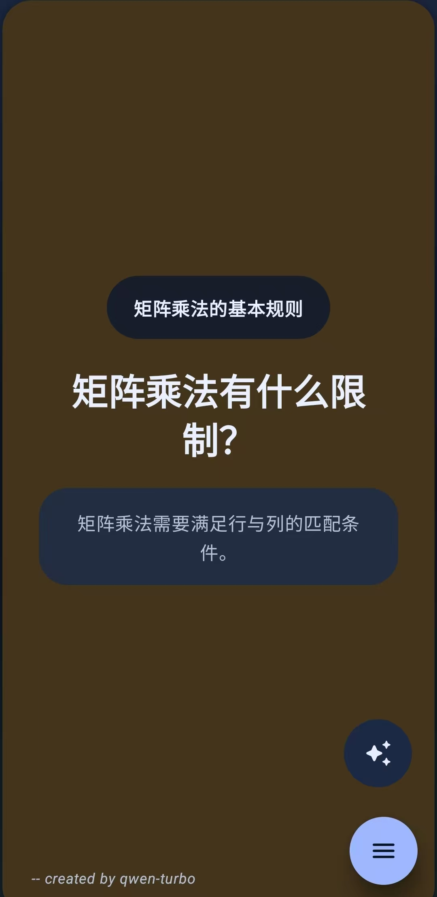
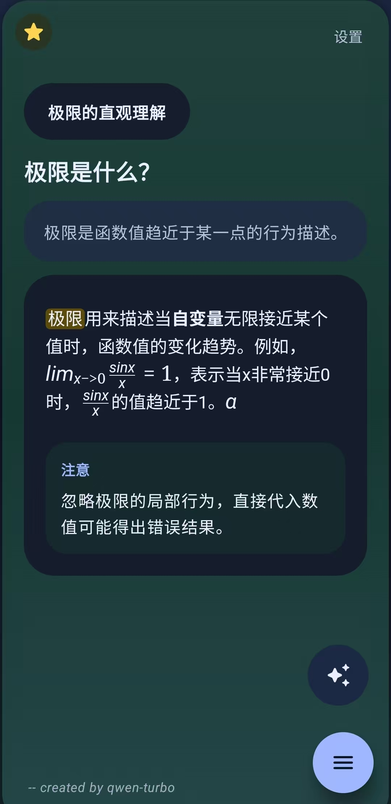
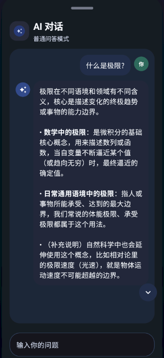
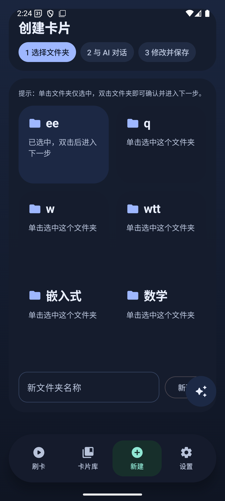
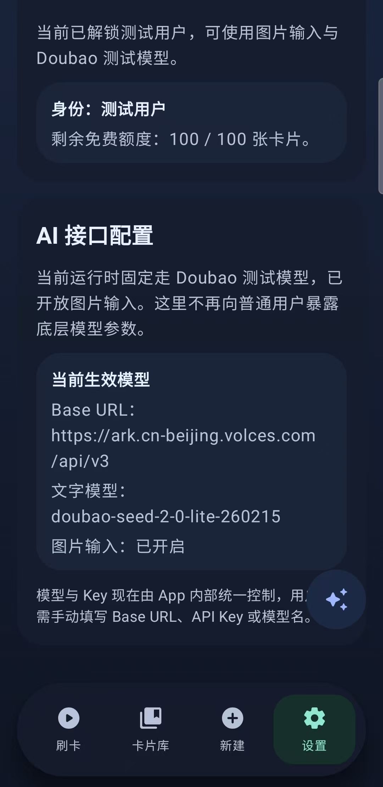
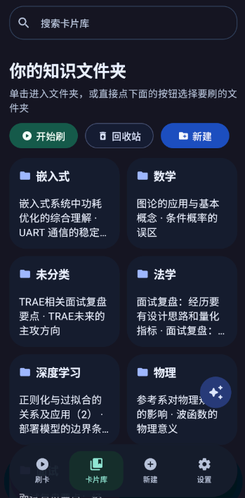

# MemFlow
产品网页：[MemFlow](https://memflow.micheljohnson.top/)

  

  <strong>把碎片知识，刷进长期记忆。</strong>

  MemFlow 是一款面向安卓端的 AI 学习卡片应用，核心目标不是“存资料”，而是把零散内容整理成可以反复刷、持续强化、真正记住的卡片流。

  <a href="./MemFlow-latest.apk">下载最新 APK</a>

---

## 产品简介

MemFlow 想解决的，不是“怎么记更多笔记”，而是“看过的内容为什么总是很快忘掉”。

它把课堂笔记、知识点总结、重点段落这类原始素材，整理浓缩成适合移动端反复 复习的知识卡片；再结合 AI 对卡片进行提炼、改写和强化，让学习过程从“收集内容”变成“形成记忆”。

相比传统笔记工具，MemFlow 更强调三件事：

- 卡片优先，而不是目录优先
- 复习节奏，而不是资料堆积
- 持续迭代，而不是一次生成就结束

---

## 界面预览

| 核心问答卡片 | 讲解与提示卡片 | AI 对话协作 | 创建卡片 |
| --- | --- | --- | --- |
|  |  |  |  |

| 当前AI接口 | Feed 复习界面 | 卡片库 |
| --- | --- | --- |
|  |  |  |

---

## 当前已完成的能力

### 1. Markdown 原生输入

支持以 Markdown 方式整理学习内容，适合课程笔记、概念总结、带层级结构的复习材料，也更方便承载公式、列表和结构化说明。

### 2. AI 强化制卡

软件内置 Qwen-Turbo 与 Doubao-Seed-2.0-lite 对原始内容进行整理和强化，自动生成标题、自测问题、答案、复习提示和易错点，让素材更适合记忆和回顾。

### 3. 围绕单张卡片持续迭代

一张卡片生成后并不是终点。你可以继续围绕当前卡片追问 AI、手动修改内容，或者继续压缩、重写和补充，让卡片越来越贴近自己的复习方式。

### 4. 移动端刷卡复习

MemFlow 已经完成了移动端刷卡式学习界面，支持在手机端持续浏览、标记重点、回看强化，让复习过程更自然，也更适合碎片时间使用。

### 5. 多文件夹刷卡

支持多个文件夹组合刷卡，可以按不同复习范围灵活切换，不再被单一路径限制。

### 6. 卡片优先管理

搜索、编辑、归档、回顾都围绕卡片展开，文件夹只承担轻量分类，而不是成为管理的负担。

### 7. 主题切换与重点标记

支持深浅色主题切换，也支持对重点卡片进行标记，方便建立自己的复习优先级。

### 8. Google Drive 同步

已经支持 Google Drive 同步能力，方便在不同设备间同步卡片内容。

### 9. 桌面端编辑工具

后续将上线桌面端配套编辑工具，便于在 Windows 上更高效地整理和维护卡片内容，并与移动端共享同一套数据结构。

---

## 当前测试说明

### AI 解析图片功能默认不能直接使用

当前调用 Doubao-Seed-2.0-lite 需要获得邀请码，如果您想参与MemFlow测试，可以在issue中反馈并留下您的邮件地址，我将通过邮件向您发送邀请码。每一个测试用户拥有100次制卡机会。非测试用户只能调用Qwen-Turbo模型进行交互。

---

## 演示视频

可以直接查看仓库中的演示素材：

- [滑动切页演示](./demo-swipe.mp4)
- [多文件夹刷卡演示](./demo-multi-folder.mp4)
- [Markdown 演示](./demo-markdown.mp4)
- [刷卡中 AI 对话演示](./demo-feed-ai.mp4)
- [AI 对话建卡演示](./demo-ai-card.mp4)
- [主题切换与标记演示](./demo-theme-mark.mp4)

---

## 安装体验

### 最新版本

- [MemFlow-latest.apk](./MemFlow-latest.apk)

### 版本存档

- [MemFlow_v0.2.0.apk](./Android_apk/MemFlow_v0.2.0.apk)
- [MemFlow_v0.3.1.apk](./Android_apk/MemFlow_v0.3.1.apk)

---

## 未来方向

MemFlow 后续会继续打通更多知识入口，而不只是停留在手动做卡：

- 长文卡片一键导入
- 多文件全自动制卡
- 短视频知识归档
- 分享卡片与卡片库，让高质量理解被更多人看到

---

## 仓库说明

当前仓库主要用于：

- 产品展示
- APK 分发
- 演示素材托管
- GitHub 页面展示

如果你正在参与测试，欢迎直接基于真实学习场景反馈问题和建议。

